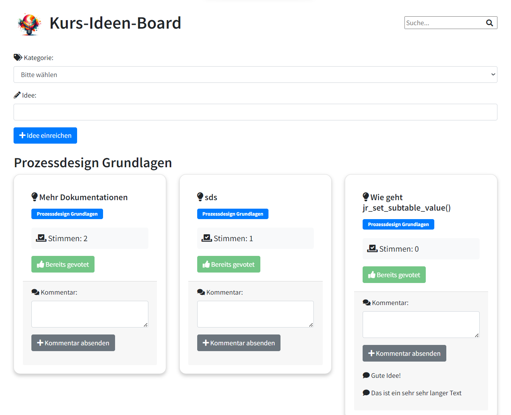

# Feature-Ideen-Board

Dieses Projekt ist ein Feature-Ideen-Board, das mit PHP und SQLite entwickelt wurde. Es ermöglicht Benutzern, Ideen für neue Features einzureichen und für bestehende Ideen zu stimmen.

## Funktionen

- Einreichen neuer Ideen: Benutzer können neue Ideen über ein Formular einreichen.
- Abstimmen für Ideen: Benutzer können für ihre bevorzugten Ideen stimmen.
- Kommentieren von Ideen: Benutzer können Kommentare zu den Ideen hinterlassen.
- Kategorisierung von Ideen: Ideen können in verschiedene Kategorien eingeteilt werden.
- Suchfunktion: Benutzer können nach bestimmten Ideen suchen.
- Admin-Seite: Es gibt eine Admin-Seite, auf der Ideen gelöscht werden können.
